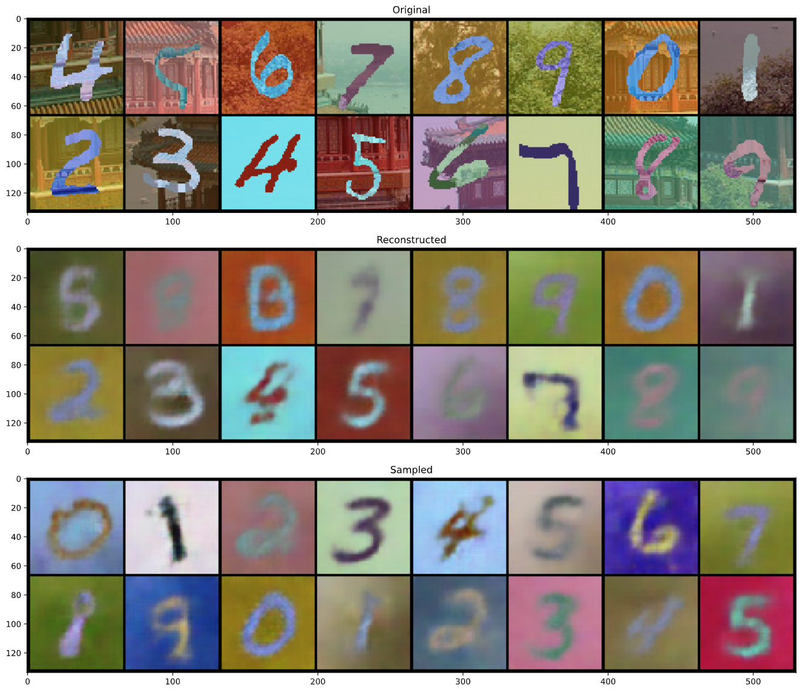
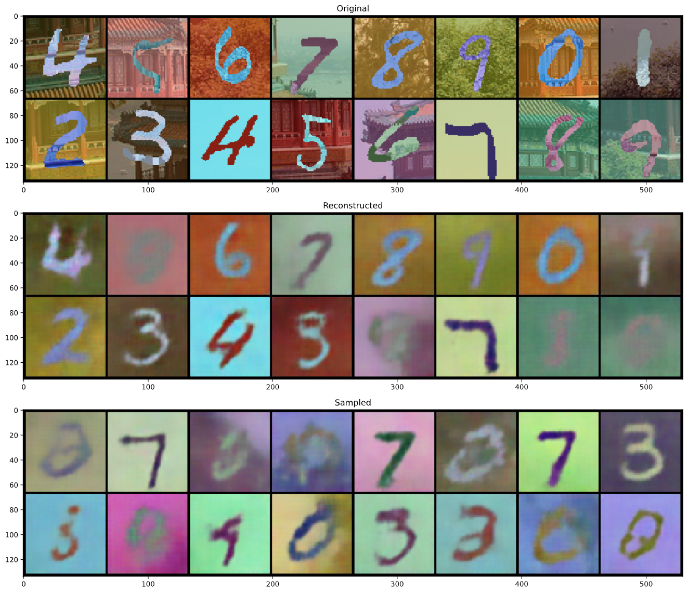

# seqlib

2D sequential modeling with VAE in PyTorch.

# Requirements

* Python == 3.7
* PyTorch == 1.5.1
* torchvision == 0.6.1

Additional requirements for example codes.

* matplotlib == 3.2.2
* tqdm == 4.46.1
* tensorboardX == 2.0

# Setup

Clone repository.

```bash
git clone https://github.com/rnagumo/seqlib.git
cd seqlib
```

Install the package in virtual env.

```bash
python3 -m venv .venv
source .venv/bin/activate
pip3 install --upgrade pip
pip3 install .
```

Or use [Docker](https://docs.docker.com/get-docker/) and [NVIDIA Container Toolkit](https://github.com/NVIDIA/nvidia-docker). You can run container with GPUs by Docker 19.03+.

```bash
docker build -t seqlib .
docker run --gpus all -it seqlib bash
```

Install other requirements for example code.

```bash
pip3 install matplotlib==3.2.2 tqdm==4.46.1  tensorboardX==2.0
```

# Experiment

Run the shell script in `bin` directory. See the script for the experimental detail.

```bash
# Usage
bash bin/train.sh <model-name>

# Example (non conditional model)
bash bin/train.sh rssm
```

# Results

|Model|Results|
|:-:|:-:|
|Recurrent State Space Model||
|Deep Markov Model||

# Example code

## Training

```python
import torch
from torch import optim

import seqlib


# Dataset
dataset = seqlib.SequentialMNIST(
    root="./data/mnist", train=True, download=True,
    data_num=50, seq_len=20, color=True, path_lena="./images/lena_color.gif")
loader = torch.utils.data.DataLoader(
    dataset, shuffle=True, batch_size=32)

# Model
model = seqlib.RecurrentSSM()
optimizer = optim.Adam(model.parameters())

for data, _ in loader:
    model.train()
    optimizer.zero_grad()

    loss_dict = model.loss_func(data)
    loss = loss_dict["loss"].mean()
    loss.backward()
    optimizer.step()
```

## Qualitative Evaluation

```python
import torch
from torchvision.utils import make_grid
import matplotlib.pyplot as plt

import seqlib


# Dataset
dataset = seqlib.SequentialMNIST(
    root="./data/mnist", train=True, download=True,
    data_num=10, seq_len=16, color=True, path_lena="./images/lena_color.gif")
loader = torch.utils.data.DataLoader(
    dataset, shuffle=True, batch_size=1)

# Model
model = seqlib.RecurrentSSM()

# Reconstruct and sample
model.eval()
data, _ = next(iter(loader))
with torch.no_grad():
    sample = model(data, time_steps=16)

data = data.squeeze(0)
sample = sample.squeeze(0)


# Plot
def gridshow(img):
    grid = make_grid(img)
    npgrid = grid.permute(1, 2, 0).numpy()
    plt.imshow(npgrid, interpolation="nearest")


plt.figure(figsize=(20, 12))

plt.subplot(311)
gridshow(data)
plt.title("Original")

plt.subplot(312)
gridshow(sample[:16])
plt.title("Reconstructed")

plt.subplot(313)
gridshow(sample[16:])
plt.title("Sampled")

plt.tight_layout()
plt.show()
```

# Reference

* J. Chung *et al*., ["A Recurrent Latent Variable Model for Sequential Data"](http://arxiv.org/abs/1506.02216) (NeurIPS 2015)
* R. G. Krishnan *et al*., ["Deep Kalman Filters"]((http://arxiv.org/abs/1511.05121)) (2015)
* R. G. Krishnan *et al*., ["Structured Inference Networks for Nonlinear State Space Models"]((http://arxiv.org/abs/1609.09869)) (AAAI 2017)
